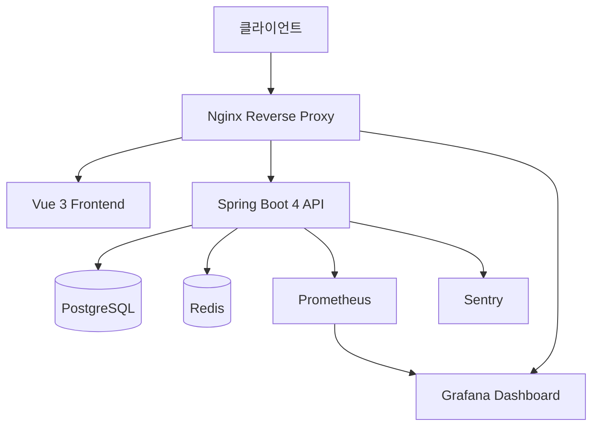
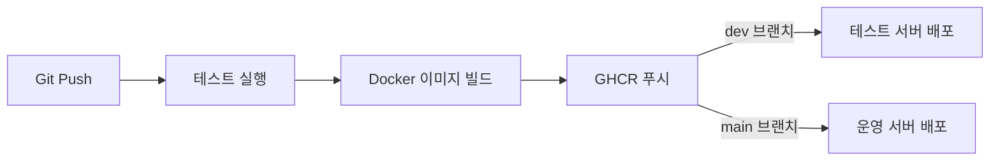
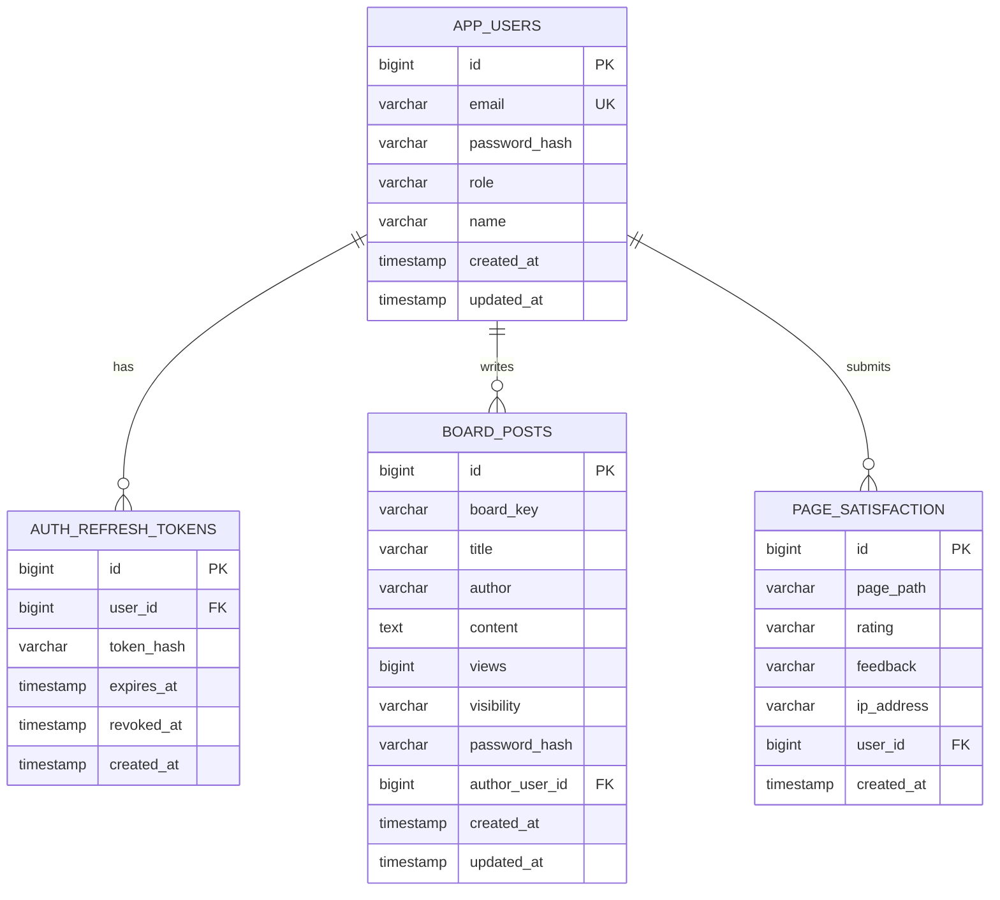

# 용산구 홈페이지 클론 — Backend

> Spring Boot 4 기반 REST API 서버 | JWT 인증 · OAuth2 · 게시판 CRUD · 모니터링

## 프로젝트 소개

용산구청 홈페이지를 클론한 포트폴리오 프로젝트의 백엔드 서버입니다.
Spring Boot 4 + Spring Security 7 기반으로 인증, 게시판, 만족도 조사 API를 제공합니다.

**배포 URL**
- 운영: `https://yongsan.minhojan-world.site`
- 테스트: `https://test.minhojan-world.site`
- Swagger: `https://yongsan.minhojan-world.site/swagger-ui.html`
- Grafana: `https://yongsan.minhojan-world.site/grafana/`

## 기술 스택

| 분류 | 기술 |
|------|------|
| Framework | Spring Boot 4.0.2, Spring Security 7, Spring Data JPA |
| 언어 | Java 17 |
| 데이터베이스 | PostgreSQL, Redis |
| 인증 | JWT (access + refresh token rotation), BCrypt |
| OAuth2 | Google, Kakao |
| API 문서 | SpringDoc OpenAPI 2.8.6 (Swagger UI) |
| 모니터링 | Prometheus + Grafana, Sentry |
| 빌드 | Gradle |
| 컨테이너 | Docker (multi-stage Alpine build) |
| CI/CD | GitHub Actions |
| 테스트 | JUnit 5, MockMvc, H2 |

## 시스템 아키텍처



## CI/CD 파이프라인



- `dev` 브랜치 push → 테스트 서버 자동 배포
- `main` 브랜치 push → 운영 서버 자동 배포
- 모든 배포 전 `./gradlew test` 자동 실행

## API 엔드포인트

### 인증 (`/auth`)

| Method | URL | 설명 | 인증 |
|--------|-----|------|------|
| POST | `/auth/signup` | 회원가입 | - |
| POST | `/auth/login` | 로그인 (rate limiting 적용) | - |
| POST | `/auth/refresh` | 토큰 갱신 (refresh token rotation) | Cookie |
| POST | `/auth/logout` | 로그아웃 (token blacklisting) | Bearer |
| GET | `/auth/me` | 내 정보 조회 | Bearer |

### 게시판 (`/api/boards/{boardKey}/posts`)

| Method | URL | 설명 | 인증 |
|--------|-----|------|------|
| GET | `/api/boards/{boardKey}/posts` | 목록 조회 (페이징, 검색) | - |
| GET | `/api/boards/{boardKey}/posts/{id}` | 상세 조회 | board2는 필수 |
| POST | `/api/boards/{boardKey}/posts` | 글 작성 | board2는 필수 |
| PUT | `/api/boards/{boardKey}/posts/{id}` | 글 수정 | 작성자/관리자 |
| DELETE | `/api/boards/{boardKey}/posts/{id}` | 글 삭제 | 작성자/관리자 |

- `board1` (칭찬합시다): 비회원 글쓰기 가능 (비밀번호 필요)
- `board2` (나도한마디): 회원 전용

### 기타

| Method | URL | 설명 |
|--------|-----|------|
| POST | `/api/satisfaction` | 만족도 조사 제출 |
| GET | `/api/health` | 헬스체크 |
| GET | `/actuator/prometheus` | Prometheus 메트릭 |

## 보안 기능

- **JWT 인증**: Access Token (15분) + Refresh Token (14일) rotation
- **토큰 블랙리스트**: Redis 기반 로그아웃 처리
- **Rate Limiting**: 로그인 IP당 1분에 5회 제한
- **비밀번호 해싱**: BCrypt (strength 12)
- **비공개 글**: 작성자/관리자만 열람, 비회원 글은 비밀번호로 접근
- **SQL Injection 방지**: Spring Data JPA 파라미터 바인딩
- **보안 헤더**: CSP, X-Frame-Options, Referrer-Policy, Permissions-Policy

## ERD



## 프로젝트 구조

```
src/main/java/com/example/demo/
├── auth/
│   ├── controller/     AuthController
│   ├── entity/         AppUser, RefreshToken
│   ├── repository/     AppUserRepository, RefreshTokenRepository
│   ├── jwt/            JwtUtil, JwtAuthFilter, TokenBlacklistService
│   ├── AuthContext.java
│   ├── RateLimitService.java
│   └── OAuth2SuccessHandler.java
├── board/
│   ├── controller/     BoardPostController
│   ├── entity/         BoardPost
│   ├── repository/     BoardPostRepository
│   ├── service/        BoardPostService
│   └── dto/            요청/응답 DTO
├── satisfaction/
│   ├── SatisfactionController
│   ├── PageSatisfaction
│   └── PageSatisfactionRepository
├── config/             SecurityConfig, OpenApiConfig, CacheConfig, SentryConfig
├── common/             GlobalExceptionHandler
└── controller/         HealthController
```

## 테스트

```bash
./gradlew test
```

- **AuthControllerIntegrationTest** — 회원가입, 로그인, 로그아웃, 인증 (9개)
- **BoardPostControllerIntegrationTest** — CRUD, 권한, 검색, 페이징, 비공개 글 (13개)
- **HealthControllerTest** — 헬스체크 (1개)
- **DemoApplicationTests** — 컨텍스트 로드 (1개)
- H2 인메모리 DB 사용, Redis 의존성 Mock 처리

## 로컬 실행

```bash
# 필요 환경: Java 17, PostgreSQL, Redis

# 환경변수 설정
export DB_URL=jdbc:postgresql://localhost:5432/yongsan
export DB_USERNAME=postgres
export DB_PASSWORD=yourpassword
export JWT_SECRET=your-secret-key-at-least-32-characters

# 실행
./gradlew bootRun
```

## 모니터링

- **Prometheus**: Spring Boot Actuator 메트릭 수집 (15초 간격)
- **Grafana**: Spring Boot 3.x Statistics 대시보드 (ID: 19004)
- **Sentry**: 500 에러 자동 캡처 (404, 403, 400은 제외)
- **Nginx Access Log**: 방문자 IP 기록
